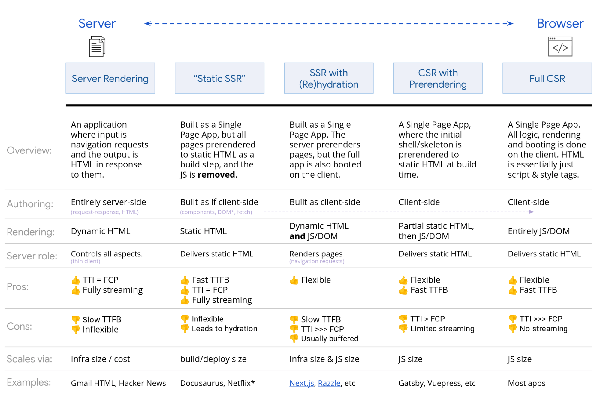

# Project starter

## Benefits

To have a successful software you need to have a great foundation. It needs to be scalable, easy to upgrade and easy to maintain.

The best approach is zero-configsolutions such as [Create React App](https://facebook.github.io/create-react-app/), [Next.js](https://nextjs.org/) or [Gatsby.js](https://www.gatsbyjs.org/). Each of them has a different use case, but they share the same idea - combine the latest web technologies under one package. Which is just perfect!

You got for free:

- new features, bug fixes and security updates with a simple update of ONE package
- easy maintenance
- great documentation
- all cured by huge community and technology leaders

## Risks not using zero-config project starters

The main risk of having dozens of dependencies is an eventual need for the upgrade. There are many updates for each library, but you can't just update them all. You also need to ensure, whether this update doesn't break anything. This makes updates really difficult sometimes and it's reflected in fact, that the project is becoming more and more outdated. This could happen even during the development itself, so basically, the project which is not finished yet is already outdated. And outdatedness itself brings a lot of security problems, performance issues, or worse developer experience.

So why even bother about this headache? Just rely on the tools mentioned above and focus on your app.

## Project starters

There are numerous zero-configuration project starters. Each of them serves a different purpose. Yet in a React ecosystem, there are many similar projects trying to achieve the same. And there are also other JavaScript alternatives like Vue.js or Angular. But since we work just with React and we are highly opinionated, let’s take a closer look at our choice:

### Create React App

Pros

- Created and maintained by Facebook
- Biggest community
- High-quality contributors (for example Tobias Koppers aka sokra - creator of webpack)
- Well known by almost any React developer, which leads to easier onboarding
- Has an outstanding documentation
- Provides maximum freedom

Cons

- Tools are preconfigured to work in a specific way, which can be changed just by “ejecting” (which we strongly recommend not to do, rather go with react-app-rewired or create-strv-app or any other fork of the main repository)
- Requires extra work to achieve the same capabilities as Gatsby or Next.js

### Next.js

Pros

- Created by Zeit
- Provides outstanding server-side capabilities
- Has static export
- Can combine server-side rendering with static export

Cons

- With server comes a huge responsibility - security
- Uses framework-specific abstractions such as getInitialProps, thus when doing a refactor to another framework

### Gatsby

Pros

- One of the best static-site generators
- Has tons of plugins
- GraphQL API for pulling data
- Uses MDX
- Gatsby Themes
- A built-in full toolkit of web developers including even image optimization

Cons

- Without partial builds (e.g. just some pages were changed, but build command has to rebuild everything) could be a bit slow
- Because of a lot of internal logic, there is a much harder learning curve

## Which one to choose?

It’s very important to choose wisely to avoid unnecessary headaches and refactoring during development. As a developer, you must know what exactly is the purpose of your app. Is that a simple landing page displaying a basic introduction of the product or a company? Or you are building an e-commerce solution? At first sight, it seems it doesn’t matter, because we are going to develop an app in React, so it will be a Single Page Application.

In fact, it matters a lot. Based on the usage we can distinguish what will be ideal project starter. Some of them are good for static export, some for server-side rendering, some just for client rendering.

There a few basic rules you can follow:

### Client-side rendering

- Your app requires user’s authentication
- You don’t care about SEO
- You are planning to implement your own routing
- A typical example: [www.tinder.com](http://www.tinder.com)
- Project starter: Create React App

### Static export

- You care about loading performance
- You care about SEO
- Static (hardcoded) content
- Content doesn’t change that often
- A lot of dynamic content will be possible with [incremental builds support](https://github.com/gatsbyjs/gatsby/issues/5002#issuecomment-531653471)
- [Gatsby-plugin-netlify-cache](https://github.com/axe312ger/gatsby-plugin-netlify-cache) to speed up build time by 10x
- A typical example: [www.lubosmid.com](https://www.lubosmid.com/)
- Project starter: Gatsby, Next.js, Create React App turned into react-static or react-snap

### Server-side rendering

- You care about SEO
- A lot of dynamic content
- You need to “hide” secrets (API keys, credentials to 3rd party services) which will be otherwise exposed in the client JavaScript bundle.
- You need maximum scalability with your infrastructure.
- Easier A/B testing
- A typical example: [www.littlespoon.com](https://www.littlespoon.com/)
- Project starter: Next.js, Create-React-App turned into Razzle

Both Gatsby and Next.js are also providing a lot of utilities out of the box. Built-in code-splitting, simple client-side routing, outstanding development experience (Hot Module Replacement) and numerous plugins and tutorials. So, why actually one should bother about Create React App, where a lot of things are missing and must be added to provide a similar experience as the previous two?

The answer is straightforward - Create React App provides you with full control over your web app, so you can adjust it based on your needs, but not being boxed-in in predefined solutions.

Also, it’s quite easy to refactor it to serve another purpose. But as mentioned above, why to worry with refactoring, when you can choose wisely from the very beginning.

## Additional information

Rendering on the web is a difficult topic. It wasn’t a long time ago when rendering was a responsibility of backend engineers. Today it’s a job for a fullstack developer.

Luckily there are many great resources available. Big kudos to Jason Miller and Addy Osmani for putting together an article on Google Developers: [https://developers.google.com/web/updates/2019/02/rendering-on-the-web](https://developers.google.com/web/updates/2019/02/rendering-on-the-web)

Last note: Sometimes it’s really hard to choose even for skilled developers. Don’t be shy and ask senior devs for opinions. They can help you and guide you. Not just in picking the correct project starter, but overall in anything. Find yourself a mentor. And later ideally become a mentor yourself. Because teaching is the best way of studying.

## Templates

Besides a good project starter, you also need to have code quality tools, testing library and much more. Why not automate the job by curated Github templates?

- [strvcom/template-react-cra](https://github.com/strvcom/template-react-cra)
- [strvcom/template-react-next.js](https://github.com/strvcom/template-react-next.js)
- \[todo\] strvcom/template-react-gatsby
- \[todo\] strvcom/template-react-native
