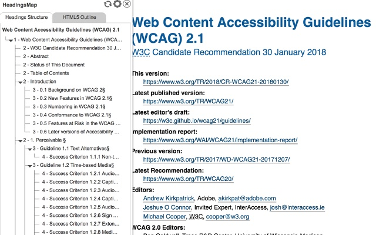

# SEO, SMO

Search Engine Optimization (SEO) is a well-known term in frontend development. It’s all about metatags, descriptions, titles and semantic markups.

The lesser-known SMO stands for Social Media Optimization. Think of any social network (the most common are Facebook and Twitter) where your users can share your website. You need to set up the appropriate meta tags for these networks, too.

## Using the right semantics

A valid, semantically-oriented HTML structure is essential if we want search engines to understand our page as much as possible. Therefore, certain rules should be met:

- To properly split document content into logical pieces, always use HTML tags for content sectioning, such as `<article>`, `<nav>`, `<header>`, `<main>`, `<footer>`, `<section>`, `<aside>`.
- Always use HTML tags that correspond with their content, e.g. `<ul>` or `<ol>` for lists etc. Never use semantically irrelevant tags only to achieve desired appearance, e.g. using `<table>` to create a list of thumbnails for gallery is _wrong_, use `<ul>` with proper styling instead.
- Make sure that structure of headings reflects your content. You can quickly check and validate you current headings structure with a [Chrome extension](https://chrome.google.com/webstore/detail/headingsmap/flbjommegcjonpdmenkdiocclhjacmbi).

## Structured data

Structured data are part of [Schema.org](https://schema.org) vocabulary, which is a part of the [Semantic web](https://www.w3.org/standards/semanticweb/) concept. It's vision is to create the Web of linked data with help of technologies that will enable people to create data stores on the Web, build vocabularies, and write rules for handling data.

It is a standardized format for providing information about a page and classifying the page content. That means, by adding structured data to our page, we provide a more accurate and targeted metadata about our content, which would otherwise be difficult or even impossible to get by automated machine-processing of our HTML content. This way we can help search engines understand our content better.

One of the benefits is that Google and some other search engines can use these extra information to show a customized search results, called _rich results_. Google supports various rich result types based on the type of our content. Full list of supported types with examples can be found at [Google Search Handbook](https://developers.google.com/search/docs/guides/search-gallery)

### Useful links:

- [Structured data testing tool](https://search.google.com/structured-data/testing-tool/u/0/) – experiment and check if your structured data have all required properties
- [Google Search Console](https://search.google.com/search-console) – debugging with real data after deployment
- [Google Search Handbook](https://developers.google.com/search/docs/guides/search-gallery) – full list of supported rich result types with examples
- [Case Studies](https://developers.google.com/search/case-studies/overview)
- [Slides from Frontend Meeting's presentation](https://speakerdeck.com/hofik9/enhancing-search-results-with-structured-data)
